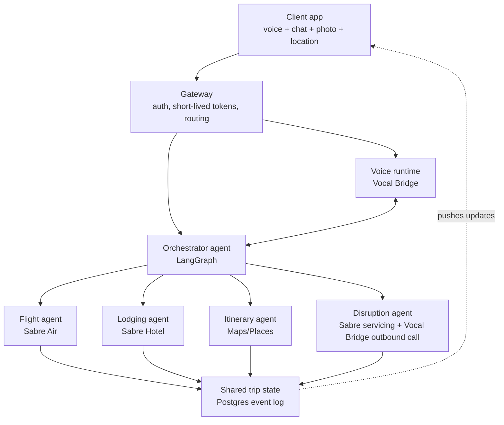

# Architecture

This is the real architecture for the product, built properly rather than rushed. Where a genuinely at-scale choice (multi-region, Kafka, sharding) would be premature before there's real usage to justify it, this doc says so explicitly and gives the right-sized starting point instead, that's good engineering judgment, not a corner cut, see the note at the end of each section marked **at scale** for what the natural next step looks like once it's warranted.

## 1. System overview



Why microservices-shaped, not a single undifferentiated script, even early on: the voice runtime is a long-lived WebRTC session with its own lifecycle, the specialist agents each depend on an external API with its own latency and failure profile (a Sabre timeout shouldn't take down the voice session), and separating them means a bug in the disruption flow doesn't risk the planning flow. In practice, this can still be **one deployable FastAPI app** with clean internal module boundaries mirroring the diagram above, so the "microservices" thinking shows up in the code's seams, not necessarily in separate running processes from day one. Split into real separate services once there's an actual operational reason to (independent scaling needs, a team large enough to own them separately), not preemptively.

## 2. Component responsibilities

- **Gateway**: issues short-lived Vocal Bridge connection tokens (the API key never reaches the client, see `docs/04_SECURITY_COMPLIANCE.md`), handles basic auth for the web/chat surface, rate-limits outbound-call-triggering endpoints specifically (Vocal Bridge caps outbound calls at 50/day per agent and 200/day per user, design the rate limiter around this explicitly so a bug or a testing loop can't silently burn the daily quota).
- **Voice runtime (Vocal Bridge)**: owns the real-time audio session. The app never talks to STT/TTS directly, it registers a query handler and an outbound-call tool with the Vocal Bridge SDK and lets Vocal Bridge's foreground/background agent split handle the latency-sensitive parts. See `docs/03_API_INTEGRATION.md` for the exact SDK calls.
- **Orchestrator**: a LangGraph `StateGraph`. Receives the user's intent (from either the voice query handler or the chat endpoint, same entry point either way, this is what keeps the two channels genuinely unified rather than two separate implementations), decides which specialist node(s) to invoke, and holds the `interrupt()` points that gate any spend or booking action on explicit confirmation.
- **Specialist agents (Flight, Lodging, Itinerary, Disruption)**: implemented as LangGraph nodes (or Temporal Activities if the workflow needs to survive longer than a single request, see §5). Each wraps exactly one external system's calls plus the light reasoning needed to turn raw offers into a ranked shortlist.
- **Shared trip state**: the single source of truth both voice and chat read from and write to. See §3.

## 3. Data structures & algorithms

These are deliberate choices, not defaults, each solves a specific problem this product actually has.

### 3.1 Trip representation: a DAG, not a flat list

Model a trip as a directed acyclic graph. Nodes are bookable or plannable events (a flight leg, a hotel stay, an activity); edges encode temporal and dependency constraints (must-arrive-before, must-check-out-before). This buys two things concretely: a topological sort validates a proposed plan for free (catches "activity scheduled before the flight lands" automatically, no special-case code needed), and when a disruption invalidates one node, walking forward from it tells you exactly which downstream nodes need recomputing, so a delayed outbound flight doesn't force a full re-plan of a hotel booking that isn't affected.

```python
# Pydantic model sketch — not final, but this is the shape
class TripNode(BaseModel):
    id: str
    kind: Literal["flight", "hotel", "activity", "ground_transport"]
    start: datetime
    end: datetime | None
    location: str          # IATA code or place ID
    depends_on: list[str]  # node ids that must complete first
    status: Literal["proposed", "confirmed", "disrupted", "cancelled"]
    booking_ref: str | None  # Sabre PNR / confirmation id once booked
```

### 3.2 Concurrent updates from voice, chat, and photos: event sourcing, not CRDTs

CRDTs solve simultaneous edits to the *same field* (two people typing in one document). That's not this product's problem. This product's problem is "voice said one thing, a photo upload triggered another update, which one actually happened and in what order." Model every state-changing action as an immutable, timestamped, append-only event (`TripEventLog` table), and derive current trip state as a fold over that log. Concretely:

```python
class TripEvent(BaseModel):
    id: UUID
    trip_id: str
    actor: str              # user id or "agent:disruption"
    kind: str                # "flight_booked", "hotel_changed", "delay_reported", ...
    payload: dict
    caused_by: UUID | None  # event id, for causal chains (a call that led to a rebooking)
    created_at: datetime
```

This gets you a free, complete audit trail (a real requirement here, "why did my flight change" needs a real answer, not a shrug), replayable history for debugging any flow after the fact, and conflict handling by ordering rather than merge logic. Pair writes with an optimistic-concurrency version check on the derived-state table to catch true races (two booking attempts on the same trip within milliseconds). **At scale**: this same model holds, you'd add snapshotting (materialize current state every N events instead of folding the whole log every read) once trips accumulate thousands of events, not a concern at the volume the early product will actually see.

### 3.3 Multi-stop route ordering: small-instance TSP, don't overthink it

"Best order to see these 4 attractions today" is the traveling salesman problem, but at real trip scale (well under 15 stops in a day) exact dynamic programming (Held-Karp, O(n²·2ⁿ)) resolves in milliseconds, or a simple 2-opt local search gets a near-optimal answer even faster. Feed pairwise travel times from the Google Directions API into whichever solver; don't compute your own road graph, that's what the API is for. This is a solved-in-20-lines problem, don't reach for a routing microservice.

### 3.4 Fan-out to voice, chat, and UI: pub/sub, not polling

One topic per trip (`trip:{trip_id}`), every connected surface (the active voice session's data channel, the chat WebSocket, any open browser tab) subscribes. When the orchestrator writes a `TripEvent`, it publishes to that topic and every surface updates. For the initial build, Postgres `LISTEN/NOTIFY` or a simple Redis pub/sub channel is enough, there's no need for Kafka at this scale. **At scale**: swap the transport for NATS or Kafka topics per trip once you need durability/replay across many consuming services; the publish/subscribe shape doesn't change.

### 3.5 Bounded concurrency for outbound calls

A semaphore-bounded worker pool (max N concurrent outbound calls) plus a per-user token bucket, so a bug or a burst of simultaneous testing can't blow through Vocal Bridge's daily call quota or place calls faster than a human could plausibly need. This is a five-line asyncio semaphore, deliberately simple rather than a piece of dedicated infrastructure, and it's the right amount of engineering for what this specific problem needs.

### 3.6 Offer ranking: a scoring function, not a model

Sabre already ranks and caches shopping results server-side. The agent's job, picking which 2-3 of N offers to actually say out loud, is a weighted linear score (price, duration, stop count, stated preference match). Don't build or fine-tune a ranking model for this until there's real usage data to train on, a hand-tuned scoring function is the right tool for this problem at this stage, not a placeholder for a future model.

## 4. The agent graph (LangGraph specifics)

Use LangGraph's `StateGraph` with a typed state schema shared across the whole orchestrator, and a **checkpointer** so the graph is resumable: if a network hiccup drops the voice session mid-booking, the graph should pick back up exactly where it left off, not restart the conversation from zero. This is not an edge case worth deferring, it will happen in normal use.

```python
from langgraph.graph import StateGraph
from langgraph.checkpoint.postgres.aio import AsyncPostgresSaver
from typing import TypedDict

class TripState(TypedDict):
    trip_id: str
    user_id: str
    messages: list          # conversation history, both voice and chat turns
    pending_proposal: dict | None
    active_leg: str | None  # which TripNode is currently being worked

# Local development: from langgraph.checkpoint.memory import InMemorySaver
# Deployed: AsyncPostgresSaver, same Postgres instance as the event log
graph = builder.compile(checkpointer=checkpointer)
```

**The confirm-gate is `interrupt()`, not a prompt instruction.** This is the mechanism, not a suggestion to the model: place `interrupt()` immediately *before* any node that calls a Sabre booking/servicing endpoint or a payment action. `interrupt_before` (not `interrupt_after`) is the correct choice here specifically because the gate must block the action, not just review it after the fact. The graph literally cannot proceed past that node without a `Command(resume=...)` carrying an explicit approval, which only fires on a clear user "yes." This is also the primary defense against prompt injection from an untrusted call transcript, see `docs/04_SECURITY_COMPLIANCE.md`, no tool output, however it's phrased, can itself satisfy the interrupt.

```python
from langgraph.types import interrupt, Command

def propose_booking(state: TripState):
    decision = interrupt({
        "type": "confirm_booking",
        "proposal": state["pending_proposal"],
    })
    if decision.get("approved"):
        return Command(goto="execute_booking")
    return Command(goto="revise_proposal")
```

For per-tool granularity (e.g. read-only Sabre shopping calls never pause, but every Sabre booking or Vocal Bridge outbound-call tool always does), the `HumanInTheLoopMiddleware` pattern from `langchain.agents.middleware` is the cleaner fit if the orchestrator is built on `create_agent()` rather than a hand-rolled graph:

```python
from langchain.agents.middleware import HumanInTheLoopMiddleware

middleware=[
    HumanInTheLoopMiddleware(
        interrupt_on={
            "search_flights": False,      # read-only, no gate
            "book_flight": True,          # always gate
            "place_outbound_call": True,  # always gate
        },
    ),
]
```

Long-term memory (user preferences across trips, "always books window seats") is a separate concern from thread-scoped checkpointing, use LangGraph's `Store` interface, namespaced by `(user_id, "preferences")`, not the checkpointer. Out of scope for the core release (§5 in the product brief), but the data model shouldn't preclude it, don't design the schema in a way that would make adding this later awkward.

## 5. Durable execution: where Temporal fits

The disruption flow has exactly the shape Temporal exists for: it may need to retry a flaky Sabre call, wait an indeterminate amount of time for the user to respond to a proposal, and survive a process restart without losing its place. If the team has real Temporal experience (worth checking early, it changes the calculus significantly), wrapping the disruption workflow specifically in a Temporal Workflow with the booking/calling steps as Activities is the technically correct call, Pydantic AI even ships an official Temporal plugin now that auto-registers agent tool calls as Activities, and `temporal server start-dev` makes local setup genuinely fast.

If the team doesn't have that experience yet, the honest, still-legitimate alternative is LangGraph's Postgres checkpointer (§4) plus explicit retry logic (a `tenacity`-style decorator with exponential backoff) around the Sabre and Vocal Bridge calls specifically. This is a real, defensible engineering choice, not a corner cut, it survives a process restart and handles the failure modes that actually occur in practice (a flaky network call), it just doesn't give the same guarantees as Temporal for a multi-hour wait. Treat "move to Temporal for the disruption workflow" as a concrete, well-understood upgrade path once the checkpointer-based version is proven to need it, not something to bolt on preemptively for its own sake. `docs/06_BUILD_PLAN.md` has the concrete decision point for when to make this call.

## 6. The planning board's live-update mechanism

The full spec for the planning board itself, layout, node/edge design, the click-to-detail interaction, lives in `docs/07_PLANNING_BOARD.md`, that document is now the authoritative source for this feature. The one architectural point worth restating here: Vocal Bridge's Client Actions are genuinely bidirectional, the same data channel that streams the voice transcript also carries `agentAction` events the backend pushes to update the board, and lets the client push events back (`vb.sendAction(...)`) when the user clicks something. This bidirectionality is what makes the board and the voice conversation one system rather than a UI that happens to sit next to a voice call, see `docs/07_PLANNING_BOARD.md` §7 for the full wiring.

## 7. Deployment target

A single containerized FastAPI backend (Docker) deployed to Railway, Render, or Fly.io (all support a Postgres add-on and deploy from a git push), and a Next.js frontend on Vercel, is the right starting point: fast to stand up, easy to iterate on, and genuinely reachable by URL rather than only running locally. This is a legitimate architecture to grow from, not merely a placeholder, revisit the deployment topology when real usage patterns (not a guess) justify something more elaborate. Environment variables for all third-party keys (Sabre, Vocal Bridge, Google Maps) live in the platform's secret manager, never in the repo, see `docs/04_SECURITY_COMPLIANCE.md`.
