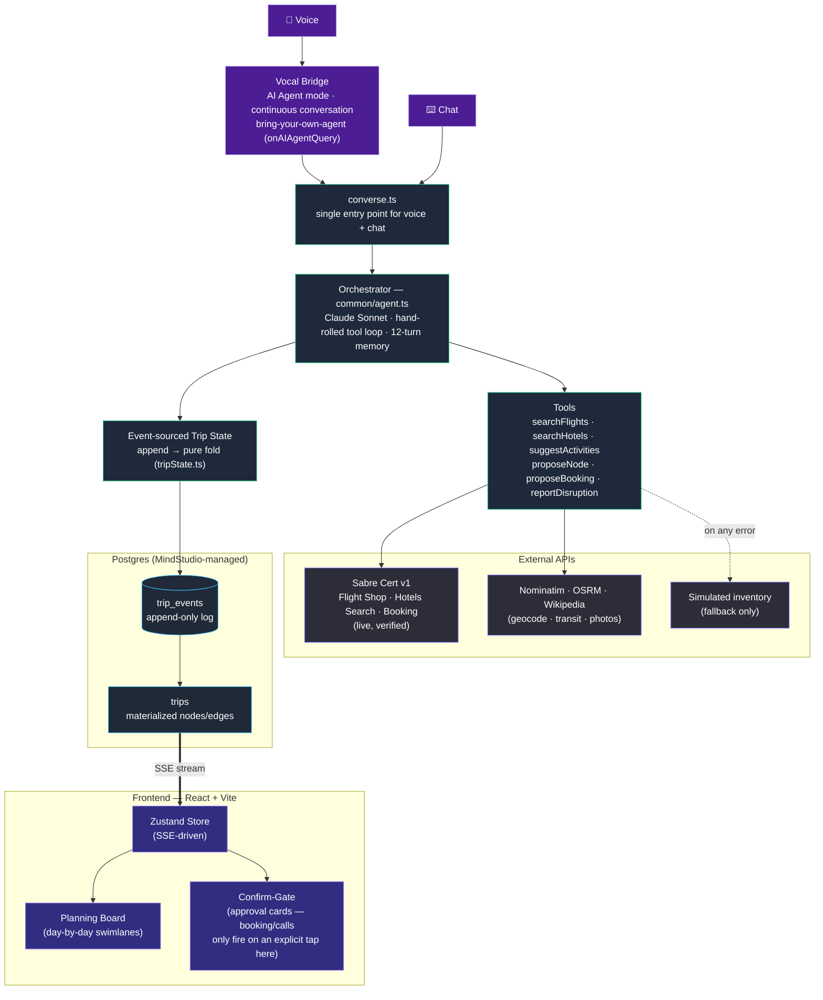
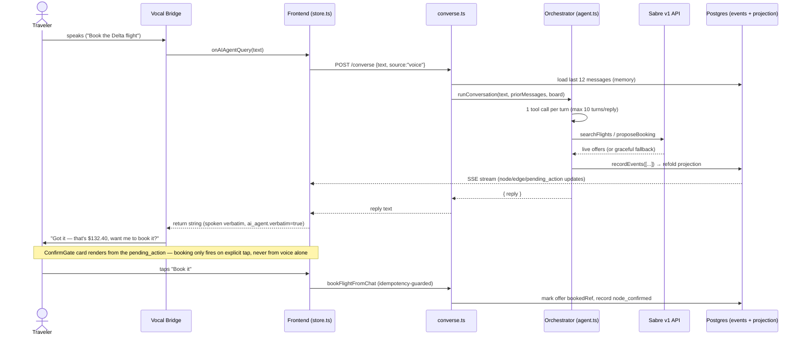
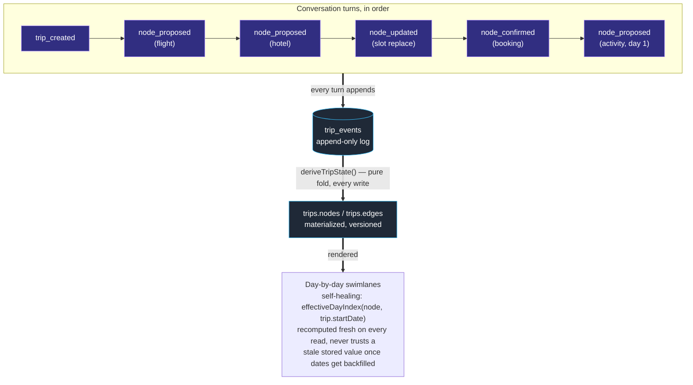

# Waypoint — Architecture Diagram

Presentation-ready diagrams of the system as it actually runs today (verified
2026-07-18). Rendered with Mermaid — GitHub, Cursor, Notion, and most slide
tools (via [mermaid.live](https://mermaid.live) export to PNG/SVG) render
these natively.

## 1. System overview

*A confirmed booking or call re-enters through the same Voice/Chat path (the traveler's tap is just another turn) — not drawn as a separate edge above, to keep this a clean one-way flow. xAI TTS (mascot one-shot narration) and the Web Speech API fallback are also omitted for clarity — see `docs/03_API_INTEGRATION.md` for the full voice fallback chain.*

**Key properties this diagram is meant to communicate:**

- **One orchestrator, two input paths.** Voice (Vocal Bridge) and chat both funnel into the same `converse.ts` → `agent.ts` orchestrator — no separate "voice logic" to keep in sync.
- **Confirm-gate is structural, not a prompt instruction.** Anything that spends money (`proposeBooking`) or places a real call renders a `ConfirmGate` card the orchestrator cannot bypass; only an explicit tap fires the booking tool.
- **Never blocks on a free/best-effort dependency.** Sabre, Nominatim, OSRM, and Wikipedia calls are all wrapped in try/catch with a graceful fallback (simulated inventory, heuristic transit label, or no photo) — a third-party outage degrades quality, never availability.
- **Trip state is event-sourced.** Every mutation appends to `trip_events`; `trips.nodes/edges` is a pure fold of that log (`deriveTripState`), re-computed on every write and safe under concurrent turns (version-checked retry).

## 2. One voice turn, end to end (sequence)

## 3. Data model — event sourcing

## How to export a slide-ready image

1. Paste any block above into [mermaid.live](https://mermaid.live) → **Actions → Export PNG/SVG**.
2. Or, in Cursor/VS Code with a Mermaid preview extension, right-click the rendered diagram → **Save as image**.
